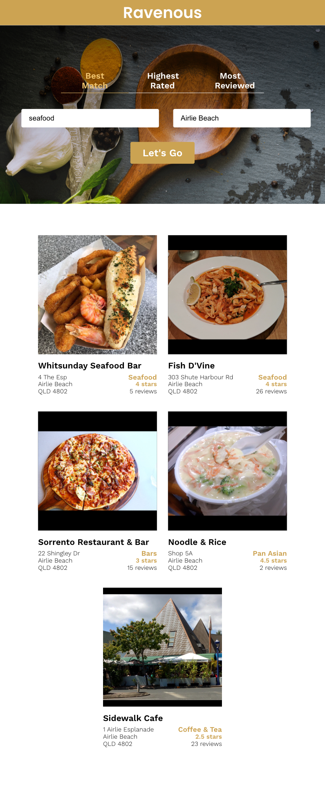
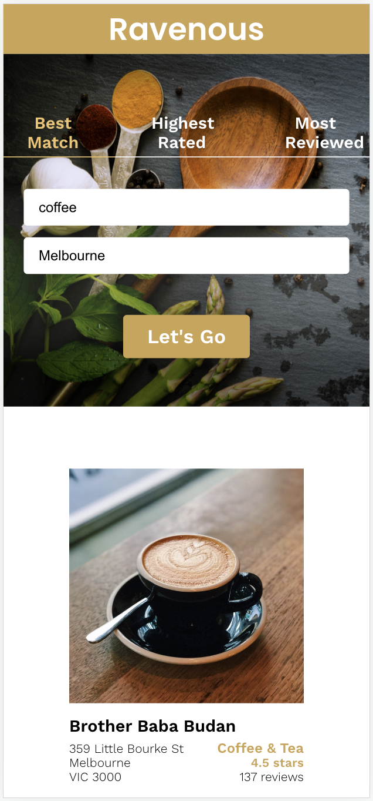

# Ravenous

This app is a practice exercise from Codecademy's course [Create a Front-End App with React](https://www.codecademy.com/learn/paths/build-web-apps-with-react). Additional components have been added to prompt the user if they have not added an API Key or enabled the Heroku demo server. The header has been updated with larger text and the responsive layout has been refined to also suit tablet screens.

## Purpose
This app allows users to enter a cuisine type or food and location and search for relevant restaurants, markets or shops. The user can sort the results by 'Best Match' to their search terms, 'Highest Rated' adjusted rating from customers, or 'Most Reviewed'.

## Yelp Fusion API
The app uses data from the Yelp Fusion API 'businesses search' endpoint.

Documentation: [https://docs.developer.yelp.com/reference/v3_business_search](https://docs.developer.yelp.com/reference/v3_business_search)

## Screenshots

### Desktop


### Tablet



### Mobile



### Error


## Instructions to use the app locally
1. Clone the code from the repo
2. Sign up for an API key at Yelp: https://www.yelp.com/developers/v3/manage_app
3. Replace the placeholder value at the top of 'src/util/Yelp.js with yout API key
```js
const apiKey = 'YourAPIKeyHere';
```
4. To avoid any issues with CORS restrictions, request temporary access to the server at: https://cors-anywhere.herokuapp.com/corsdemo

5. In your terminal, in the project directory, you can run:
```js
npm start
```
This runs the app in  development mode.
If it does not open automatically, open [http://localhost:3000](http://localhost:3000) to view it in your browser.

